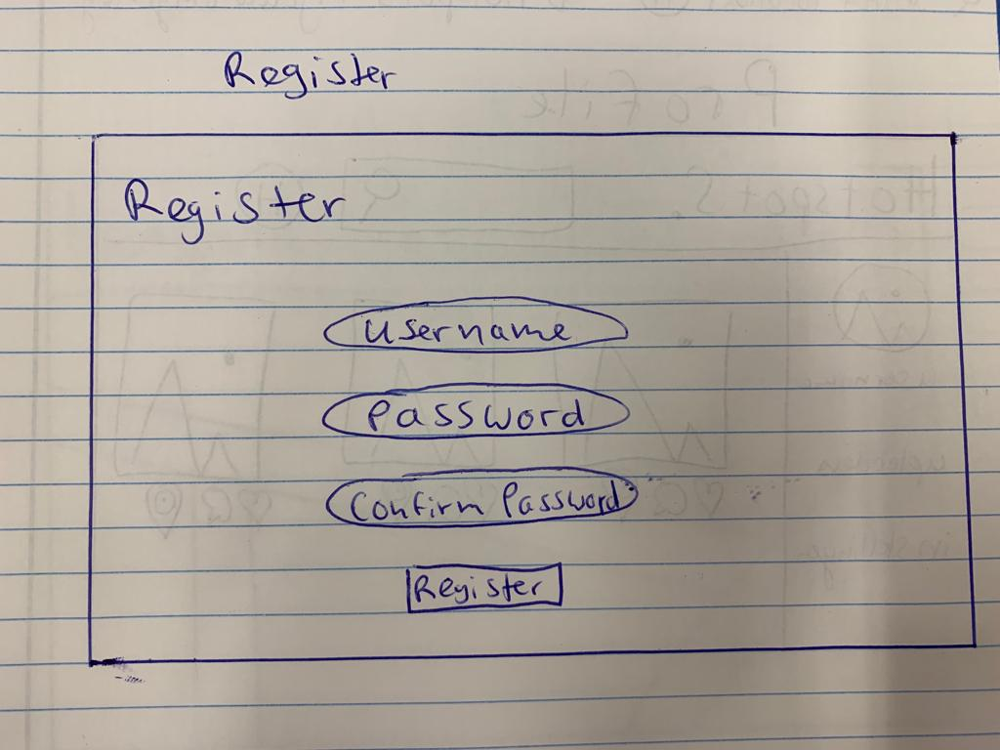
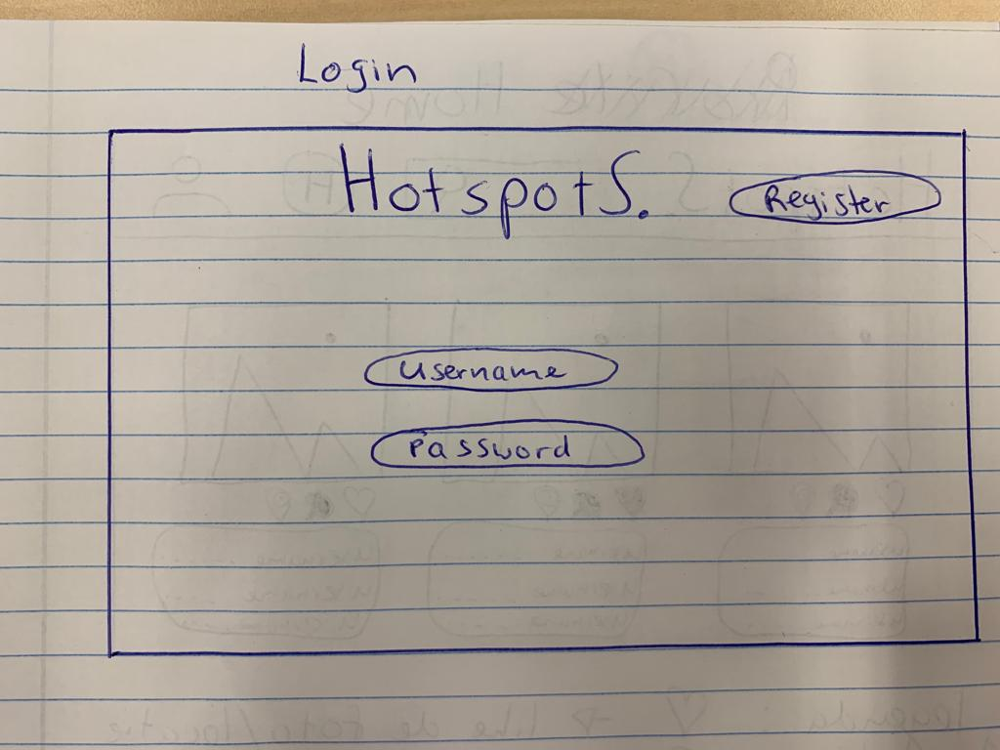
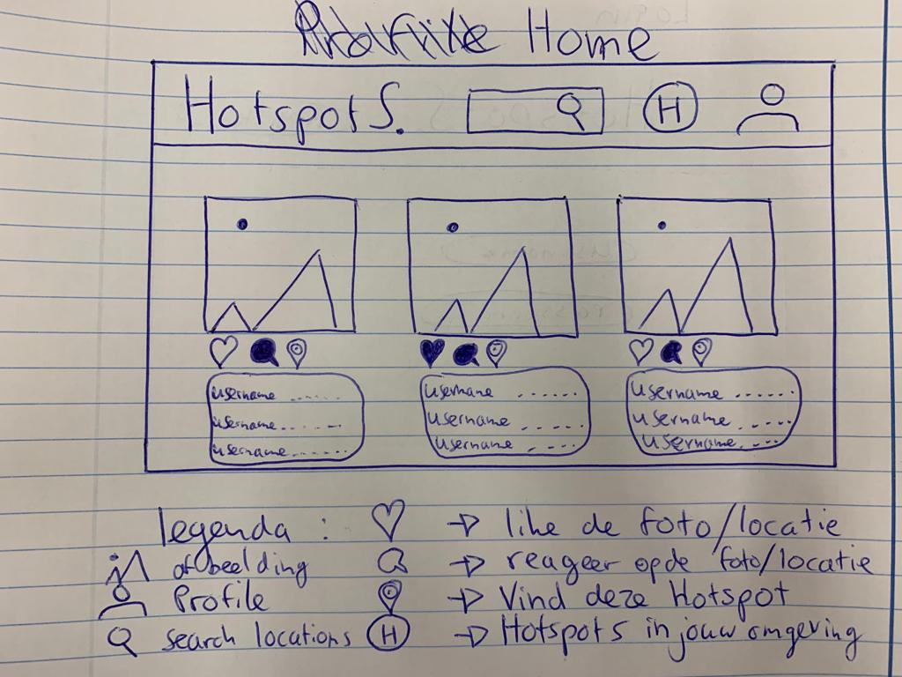
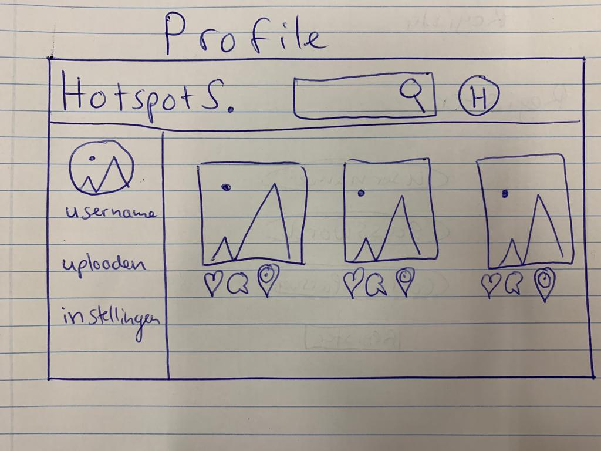
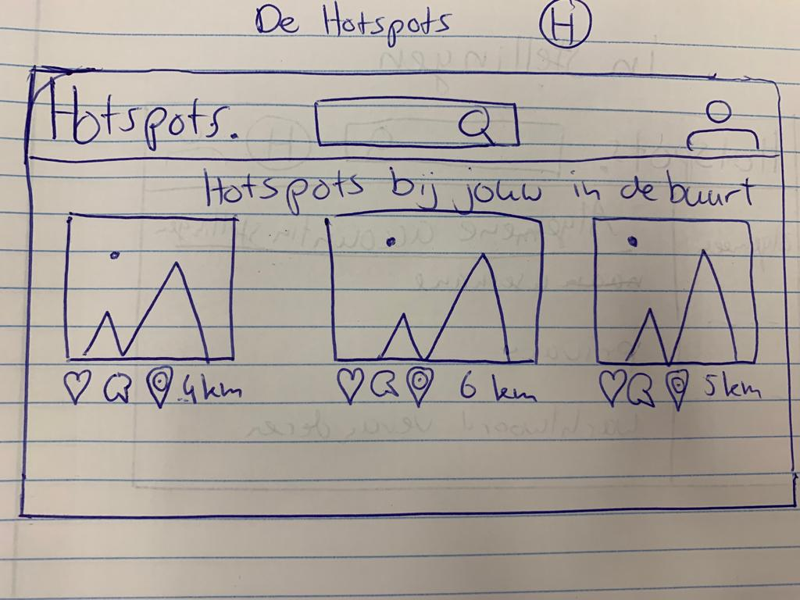
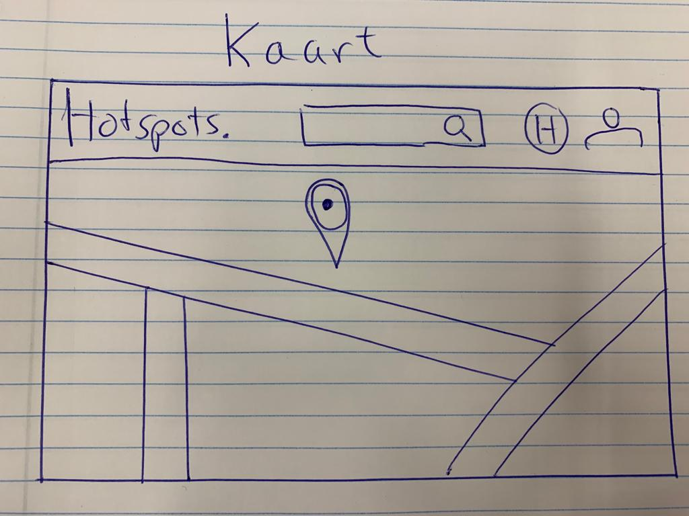
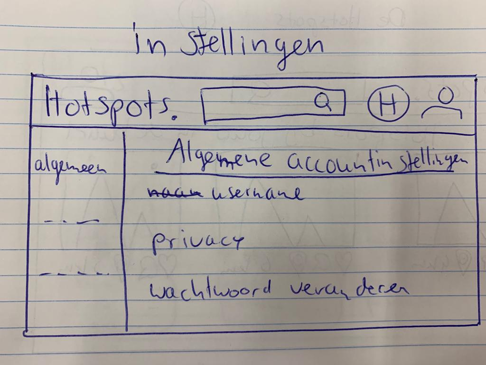

# Technisch ontwerp

## Controllers
### Routes:
- Login (inloggen met verplicht invullen gebruikersnaam en wachtwoord)
    - @app.route("/login")
    - met scherm
    - GET & POST

- Register (registeren met herhalen wachtwoord en direct naar de homepage)
    - @app.route("/register")
    - met scherm
    - GET & POST

- Logout (uitloggen en terug naar login)
    - @app.route("/logout")
    - geen scherm

- Index (tijdlijn met steden die je volgt)
    - @app.route("/index")
    - met scherm
    - GET & POST

- Profile (foto's zichtbaar die jezelf geupload heb)
    - @app.route("/profile")
    - met scherm
    - GET & POST

- Browse (zoeken naar steden met als resultaat foto's van die stad)
    - @app.route("/browse")
    - geen scherm
    - POST

- Results (resultaten van browse functie)
    - @app.route("/results")
    - met scherm
    - GET & POST

- Settings (instellingen om wachtwoord en gebruikersnaam te veranderen)
    - @app.route("/settings")
    - met scherm
    - GET & POST

- Upload (nieuwe fotos uploaden)
    - @app.route("/upload")
    - met scherm
    - GET & POST

- Follow (functie om steden te volgen, zodat deze in je tijdlijn verschijnen)
    - @app.route("/follow")
    - geen scherm

- Location (opvragen precieze locatie van een foto)
    - @app.route("/location")
    - geen scherm

- Lookup (pop-up google maps met de locatie van de hotspot)
    - javascript realtime

- Like (likes van een foto bijhouden in een database)
    - in helpers.py
    - geen scherm

- Nearby (foto's te zien krijgen die in jouw buurt zijn gemaakt)
    - @app.route("/nearby")
    - met scherm
    - GET

## Views

